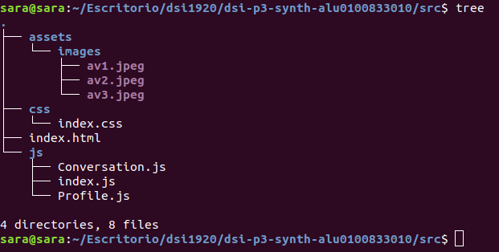
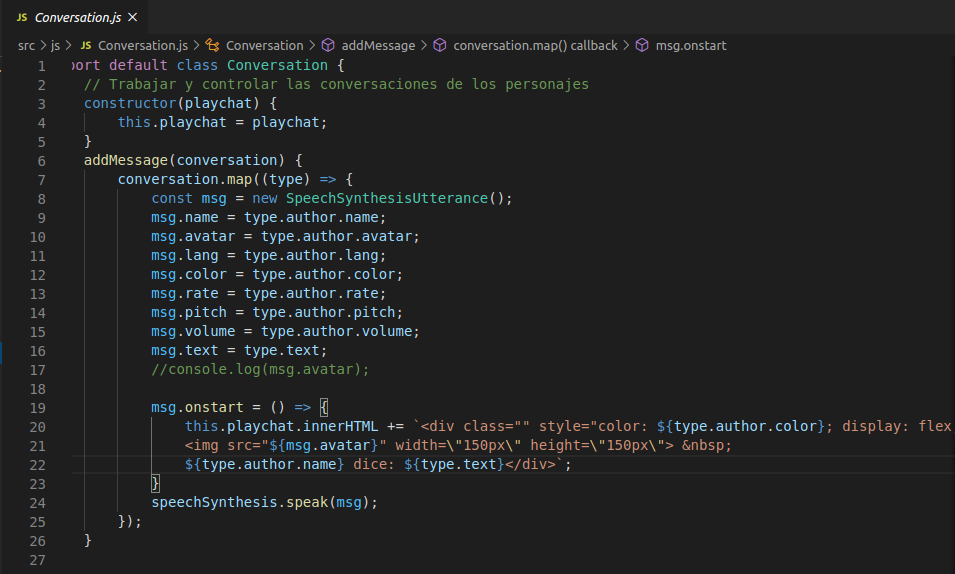
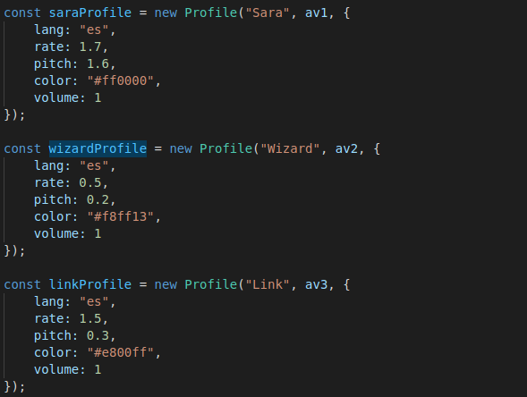
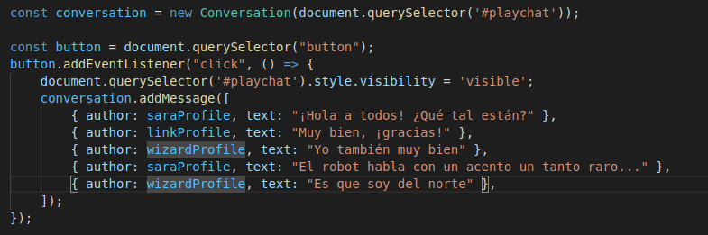
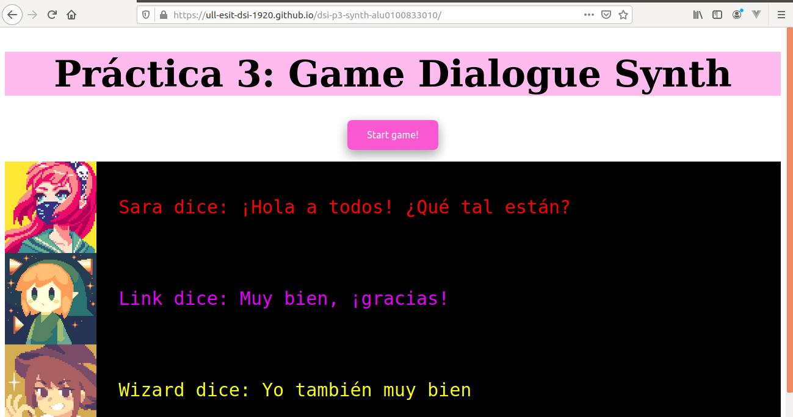

# dsi-p3-synth-alu0100833010

_Práctica 3.  Javascript + SpeechSynth._

## Descripción de la Práctica  dsi-p3-synth.

Vamos a utilizar la API de síntesis de voz del navegador para construir un sistema simple de diálogos para un juego.

El objetivo es crear varios perfiles de personajes, cada uno con sus propias características particulares. 

## Comenzando

### 1. Crea un proyecto en _Parcel_.

Para comenzar la práctica  crearemos un proyecto con Parcel para poder trabajar y realizar la práctica. Para ello comenzamos
creando la estructura del proyecto .

#### Pasos para crear el proyecto.

* **Scaffolding** 

  Creamos las carpetas:
  ```
  mkdir -p nombre-repo/src/{css,js,assets}
  ```
  Nos situamos en el repo:
  ```
  cd nombre-repo
  ```
* **Git**

  Inicializamos el repo con git:
  ```
  git init
  git remote add origin...
  touch .gitignore
  touch README.md
  ```
* **NPM**

  Inicializamos el repo con npm:
  ```
  npm init -y
  ```
* **Instalación de ParcelJS**
  ```
  // Instalamos parcel en nuestro proyecto.
  npm install -D parcel-bundler
  
  // Punto de entrada para parcel.
  npx parcel src/index.html
  ```
* **Linters**
  ```
  npm install -D eslint
  ```
* **Formateador de código: Prettier**
  ```
  // Configurar nuestro proyecto para Prettier
  npm install -D prettier
  
  // Plugins para evitar conflictos entre Prettier y ESLint.
  npm install -D eslint-config.prettier eslint-plugin-prettier
  ```
  
  Tras esto, la estructura final del proyecto quedaría:
  
  
  
### 2. Código _Javascript_.

Utilizando módulos de Javascript, creamos dos clases **Profile** y **Conversation**:



* `Profile.js`:

La clase **Profile** guarda las características del personaje, donde se pueden encontrar cosas como la velocidad de diálogo, el avatar del personaje o el color del texto.


* `Conversation.js`:

La clase **Conversation** trabaja y controla conversaciones de todos los personajes. 
 


La función `addMessage()` se encarga de asignar las características que tendrá cada mensaje del chat así como el texto que se va a reproducir. Por último, las inyectamos como código _HTML_ indicando cómo debe aparecer el mensaje, por ejemplo, el color del texto asignado según cada personaje, el avatar, el nombre, etc. 

* `index.js`:


 
Instanciamos los objetos de tipo **Profile** con las características que tendrá cada uno de los perfiles de los personajes. 



Para generar el chat, creamos un botón que al clickar sobre él, muestre el cuadro de diálogo y llamamos a la función `addMessage()` y le indicamos el texto a reproducir y el perfil del personaje.

### 3. Publicación en _gh-pages_.
 
Para publicar nuestro proyecto en **gh-pages**, ejecutamos los siguientes comandos:
```
$ npx parcel build src/index.html --no-minify
$ npx parcel build src/index.html --no-source-maps --detailed-report
$ npx parcel build src/index.html --public-url /dsi-p2-jspotify-alu0100833010/ -d build
$ npx gh-pages -d build
```


Enlace:  https://ull-esit-dsi-1920.github.io/dsi-p3-synth-alu0100833010/
